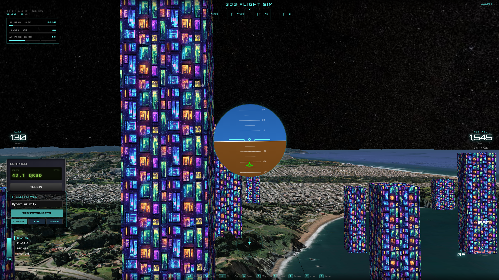
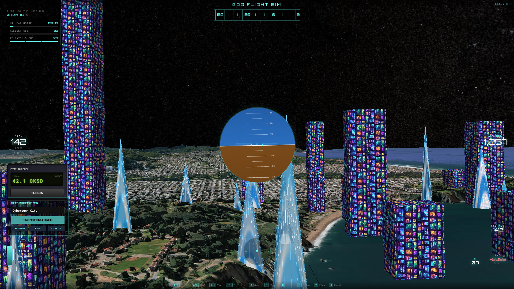

# Build with AI: Infinite Flight Simulator


A browser-based 3D flight simulator built with vanilla JavaScript, CesiumJS, and a Flask backend integrating Vertex AI for dynamic terraforming. It specifically demonstrates "Infinite Loop" memory architecture to survive rendering massive 3D Photorealistic Google Maps tiles without crashing the browser's V8 engine.

---

## 🚀 Running the Project (For Demo)

This project uses Python for the backend to proxy Vertex AI and Earth Engine requests. Following your preference, we will use `uv` for lightning-fast dependency management.

### Prerequisites

1.  **System Requirements:** Review the **[INSTALL_GUIDE.md](./INSTALL_GUIDE.md)** for a complete list of required tools (Git, gcloud, uv, and a modern web browser) and how to install them on your OS.
2.  **Google Cloud Setup:** You need an active Google Cloud project with billing enabled, Vertex AI and Earth Engine APIs enabled, and a valid `service-account-key.json` in the root of this directory. **[Please read the complete CLOUD_SETUP.md guide](./CLOUD_SETUP.md)** for step-by-step instructions and helpful setup scripts for Windows, Mac, and Linux.
3.  **uv:** Ensure you have `uv` installed.

### Start the Server

You can run the Flask app directly using `uv`. We force it to use Python 3.12 because some AI dependencies (like `protobuf`) do not yet support bleeding-edge Python versions (like 3.14):

```bash
uv run --python 3.12 --with flask --with requests --with earthengine-api --with google-cloud-aiplatform app.py
```

---

## Architecture Highlights

- **CesiumJS Cache Annihilation:** Aggressively caps memory to 256MB.
- **Velocity-Linked Degradation:** Dynamically drops texture resolution during high-speed turns to prevent VRAM spikes.
- **AI Terraformer (Vertex AI & Earth Engine):** The simulator uses Vertex AI as an image-to-image generator (`imagegeneration@006`) to perform real-time "terraforming." 
  
  
  
  First, the Python backend uses Google Earth Engine to grab a real, high-resolution satellite image of the terrain directly beneath the plane. That real satellite image is then passed to Vertex AI along with the user's text prompt (e.g., "Cyberpunk City"). Vertex AI generates a new, themed image matching the real-world geometry and perspective, which CesiumJS then projects back onto the 3D globe in real-time. It uses a strict FIFO queue that aggressively dereferences and destroys old patches to save memory.
  
  

- **V8 Heap Monitor:** Real-time memory usage readout on the HUD.

---

## 🛠 Troubleshooting Common Issues

If you run into errors starting the server or generating images, check these common fixes:

### 1. "Permission Denied" or "403 Forbidden"
*   **Cause:** Your Service Account doesn't have the right permissions.
*   **Fix:** Ensure your service account has both **Vertex AI User** and **Earth Engine Resource Viewer** roles assigned in the IAM console.
*   **Earth Engine Note:** You may need to manually visit [earthengine.google.com/signup](https://earthengine.google.com/signup) once with your Google account to "accept" the terms of service for that project.

### 2. "API Not Enabled"
*   **Cause:** The required Google Cloud APIs are dormant.
*   **Fix:** Ensure both **Vertex AI API** and **Google Earth Engine API** are enabled in your Google Cloud Console "APIs & Services" dashboard.

### 3. "service-account-key.json not found"
*   **Cause:** The backend can't find your credentials.
*   **Fix:** Ensure the file you downloaded from Google Cloud is renamed to exactly `service-account-key.json` and placed in the **root** of this project (next to `app.py`).

### 4. "Vertex AI Quota Exceeded"
*   **Cause:** You've hit the rate limit for image generation on a new project.
*   **Fix:** Wait 1-2 minutes and try again. For a workshop, this is rarely an issue unless everyone uses the same project ID (don't do that!).

---

## 📸 Capturing the Best Screenshots for LinkedIn

1.  Open your browser to [http://localhost:8080](http://localhost:8080).
2.  **The Landing Page:** You will be greeted by the "Build with AI: Infinite Flight" start screen with CRT scanning lines. This makes for a great initial hype screenshot.
3.  **The Flight:** Select a location (e.g., "Sunnyvale" or "San Francisco").
4.  **Camera Angles:** Once flying, press `V` to cycle camera modes (Cockpit, Chase, External, Flyby) to get the most cinematic angles of the 3D tiles.
5.  **The Money Shot (Memory Eviction):** 
    *   Use the AI Terraformer panel on the bottom left.
    *   Click the preset buttons ("CYBERPUNK", "MARS", "ATLANTIS") to generate patches.
    *   Generate a 4th patch to trigger the FIFO queue limit.
    *   **Screenshot the red "INFINITE LOOP: EVICTING OLD PATCH" toast notification** that appears on screen! This proves your memory architecture works and makes for an excellent technical talking point in your post.
